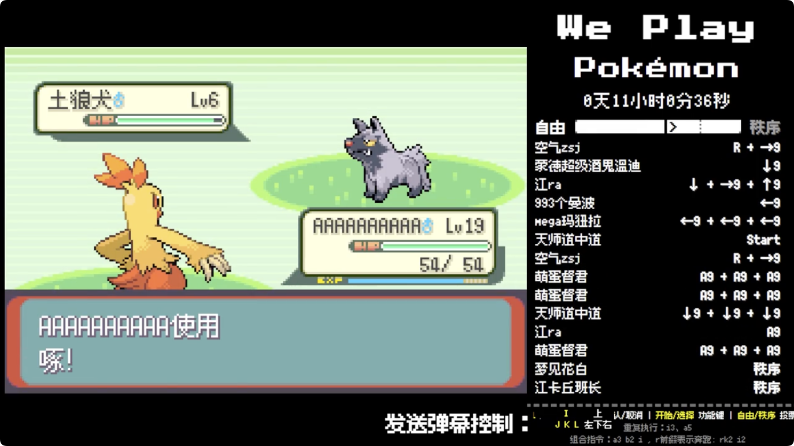
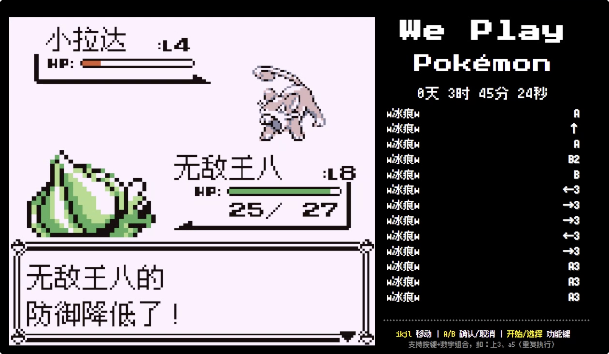

# We-play-Pokemon


We-play-Pokemon 是一个基于 Python 的项目，旨在通过直播弹幕控制游戏操作，右侧显示接收到的所有合法指令，每次执行一条最新的指令。致敬Twitch Plays Pokémon。

直播实况录制：

[宝可梦·火红 直播实况录制 已通关 用时7天](https://www.bilibili.com/video/BV1DWeyz5E6J/?vd_source=ca16a8b17de72af914e0d643f6cc97e6)

[宝可梦·绿宝石 直播实况  已通关 用时16天](https://www.bilibili.com/video/BV1DWeyz5E6J/?vd_source=ca16a8b17de72af914e0d643f6cc97e6)

2025-9-20 21:19
**完结撒花🎉**

具备自由和秩序两种模式，也可以通过设置调整是否开启投票


初代宝可梦直播测试



## 项目结构

```
We-play-Pokemon/
├── bilibili_mgba_controller.py  # 主控制器脚本
├── close_port_5000.bat          # 关闭端口的批处理文件
├── pyproject.toml              # 项目配置文件
├── README.md                   # 项目说明文件
├── requirements.txt            # Python 依赖包列表
├── start_time.txt              # 启动时间记录
├── uv.lock                     # 锁文件
├── blivedm/                    # 弹幕处理模块
│   ├── __init__.py
│   ├── handlers.py
│   ├── utils.py
│   └── clients/
│       ├── __init__.py
│       ├── open_live.py
│       ├── web.py
│       └── ws_base.py
├── models/                     # 数据模型模块
│   ├── __init__.py
│   ├── open_live.py
│   └── web.py
├── static/                     # 静态资源
│   ├── fusion-pixel-10px-monospaced-ko.ttf.woff
│   ├── fusion-pixel-10px-proportional-ko.ttf.woff
│   ├── fusion-pixel-12px-monospaced-ko.ttf.woff
│   ├── fusion-pixel-12px-proportional-ko.otf.woff
│   └── fusion-pixel-8px-monospaced-ko.ttf.woff
└── templates/                  # HTML 模板
    └── index.html
```

## 安装与运行

### 环境依赖

请确保已安装以下工具：
- Python 3.12 或更高版本
- pip

### 安装步骤

1. 克隆项目到本地：
   ```bash
   git clone https://github.com/Ninot1Quyi/We-play-Pokemon.git
   ```

2. 进入项目目录：

3. 安装依赖：


### 运行项目

运行主脚本：
```bash
python bilibili_mgba_controller.py
```

## 贡献

欢迎提交 Issue 和 Pull Request 来帮助我们改进项目。

## 协议
# We-play-Pokemon

## 许可证
本项目采用 GNU 通用公共许可证第3版（GPLv3）发布。详情请见 [LICENSE](LICENSE) 文件。

您可以自由复制、分发和修改本程序，但需遵守 GPLv3 的条款。源代码可在 [本仓库](https://github.com/Ninot1Quyi/We-play-Pokemon) 获取。
